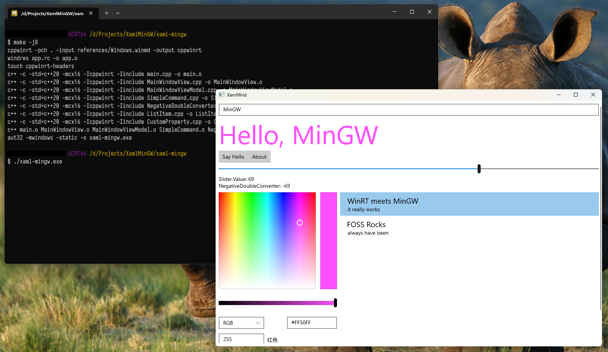

# MinGW XAML Islands Demo

This is a demo of WinRT XAML Islands with MinGW toolchain.



## Why

To stress test the new C++/WinRT MinGW support mostly, also it is fun.

## Build

To build this, you'll need the following:

- C++/WinRT `cppwinrt.exe` in `$PATH`
- A MinGW toolchain, LLVM/Clang 15 and GCC 12 from MSYS2 are tested.

The best way to get a working toolchain is install the following in MSYS2:

```
# CLANG64 Subsystem, with LLVM/Clang
pacman -S mingw-w64-clang-x86_64-toolchain mingw-w64-clang-x86_64-cppwinrt

# UCRT64 Subsystem, with GCC
pacman -S mingw-w64-ucrt-x86_64-toolchain mingw-w64-ucrt-x86_64-cppwinrt
```

With these, just build using the makefile provided.

## What works

- XAML layout (load in **runtime** only)
- `IValueConverter` (initialized in code-behind)
- Data binding with `ICustomPropertyProvider` (see `MainWindowViewModel.cpp` on how to implement this, it sucks but eh)
- `ICommand`
- Setting events from code-behind

## What doesn't

- Compiled XAML and `x:Bind`
- Automatically generated control references via `x:Name` (so you'll need to crawl through the logical tree to get to your controls)
- Anything else? Feel free to hack around
